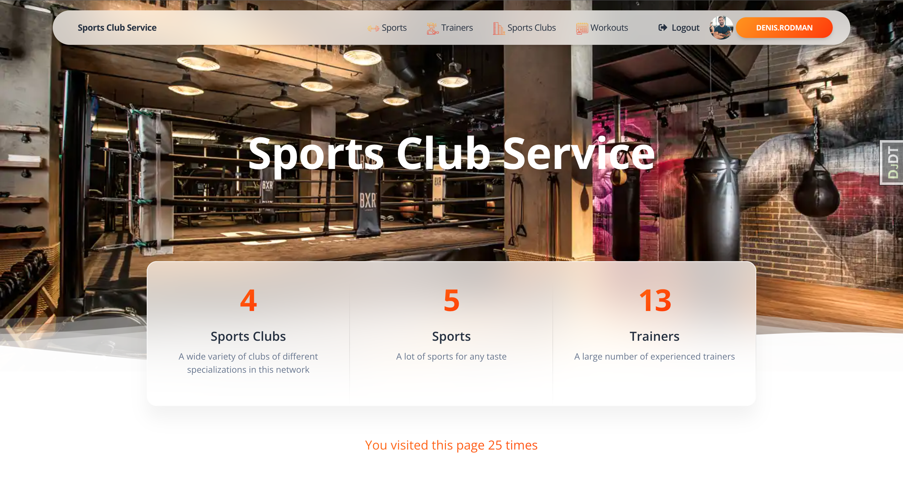

# sports-club-service

Django project for managing sports clubs in the sport club network with trainers(users) and their workouts

## Check it out!
[Sports Club project deployed to Render](https://sports-club-service.onrender.com/)
test data:
username: jack.brown
password: edcujm37

## Instalation

Python3 must be already installed

```shell
git clone https://github.com/misha-doroshenko/sports-club-service
cd sports-club-service
python3 -m venv venv
source venv/bin/activate
pip install -r requirements.txt
python manage.py runserver  # starts Django project
```

## Features

* Authentication functionality for Trainer/User
* Managing sports clubs, workouts and trainers directly from website
* Custom admin panel
* Ability to load media files

## Demo

